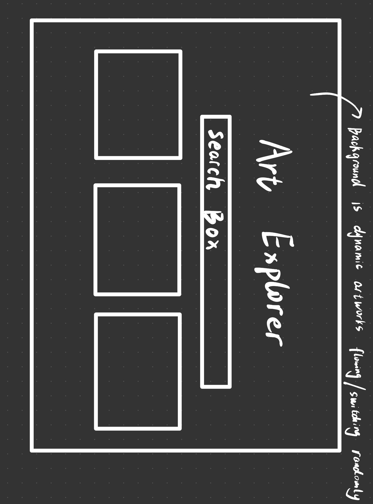
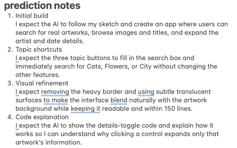
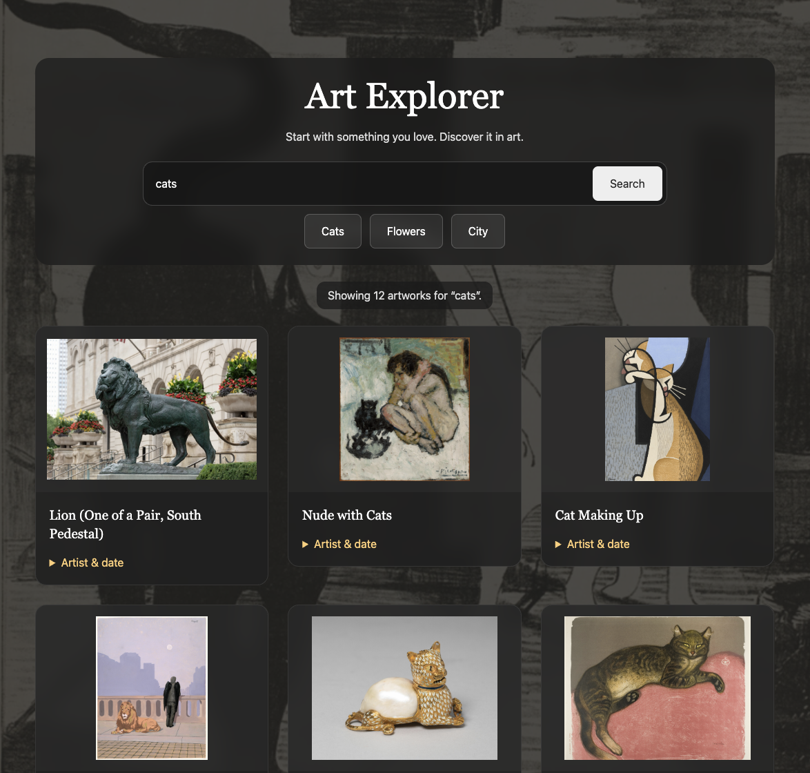
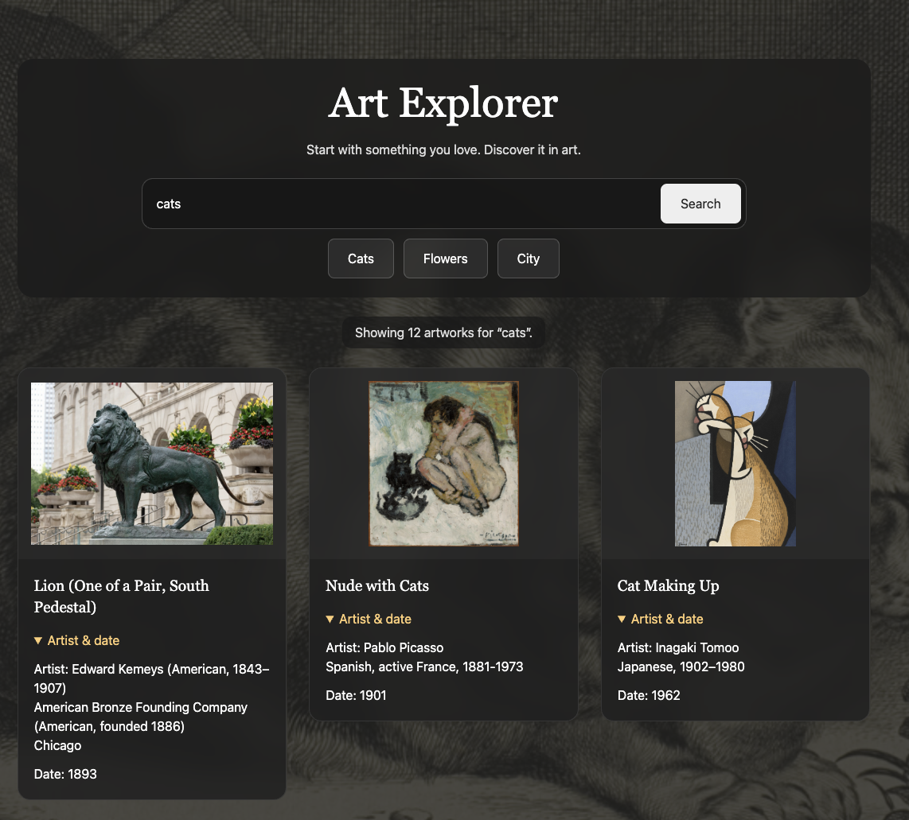
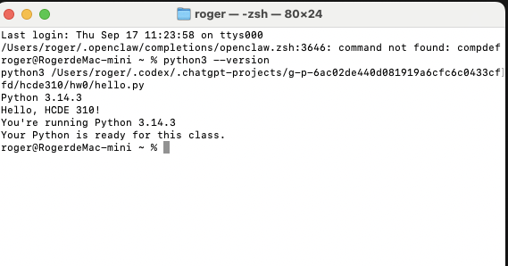

# Day 1 "before" snapshot

Write your own, even if you worked in a pair. Keep it: we come back to it at mid-quarter (Week 6) and at the end (Week 11). Your prompts go in `ai_log.md`, not here.

**Name:** roger10-tang (GitHub account supplied for author information)
**Partner (if any):** None; I worked alone.

## Before we prompted

### 1. Who is it for, and what do they want to do?

It's for college students who are new to art and want to discover artworks through topics they already enjoy.

**"The user can..." sentences:**
1. The user can search real artworks by topic, including Cats, Flowers, and City shortcuts.
2. The user can browse artwork images and titles.
3. The user can expand and collapse artist and date details for each artwork.

### 2. Our sketch

Put the photo in this `hw0` folder, then change the filename below to match:



I confirmed IMG_1055.jpg is my original sketch photo.

### 3. Our prediction

I supplied the following prediction-notes screenshot when revising this submission. It covers the initial build, topic shortcuts, visual refinement, and code explanation. The screenshot does not establish when the notes were written; my earlier statement that I had not recorded a confirmed prediction before the first prompt remains part of the record.



- **Initial build:** I expect the AI to follow my sketch and create an app where users can search for real artworks, browse images and titles, and expand the artist and date details.
- **Topic shortcuts:** I expect the three topic buttons to fill in the search box and immediately search for Cats, Flowers, or City without changing the other features.
- **Visual refinement:** I expect removing the heavy border and using subtle translucent surfaces to make the interface blend naturally with the artwork background while keeping it readable and within 150 lines.
- **Code explanation:** I expect the AI to show the details-toggle code and explain how it works so I can understand why clicking a control expands only that artwork’s information.

## What we got

### 4. What the AI made

Put the screenshot in this `hw0` folder, then change the filename below to match:





The final supplied screenshots show cats search results with loaded images and titles, first with details collapsed and then with the first three cards’ artist/date details expanded. They match the final visual refinement: no heavy outer border, rounded cards, and translucent controls. These are my supplied screenshots, not screenshots produced by the AI.

Website: [Art Explorer](https://art-explorer-hcde-roger.roger1of1.chatgpt.site). Final source: [index.html](index.html), exactly **150 lines**, including blank lines and comments, counted from the copied file.

### 5. Sketch vs. app

- **Matches our sketch:** Centered title and search box, three columns on wide screens, artwork images, and a changing artwork background.
- **Different from our sketch:** Multiple rows of results, card titles and detail controls, responsive two-/one-column layouts, and a final design with translucent surfaces and rounded cards instead of the heavy outer frame.
- **The AI decided** (something we never said): The Search button, introductory sentence, museum credit link, 12-result limit, exact fallback messages, 15-second timeout, native details/summary controls, background timing, reduced-motion support, and responsive breakpoints. I explicitly requested shortcuts and the later visual refinement; the AI chose their exact implementation and CSS values.

### 6. What did I keep, change, or reject, and why?

I kept the search, artwork cards, and expandable details because they support the goal of helping college students discover art through familiar topics.

I added Cats, Flowers, and City shortcuts to make it easier to start exploring. The buttons fill the search box and submit the existing search form.

I changed the heavy border and boxed appearance so the interface would blend more naturally with the artwork background while keeping the information readable. That earlier styling was replaced. I did not report any additional rejected features or suggestions.

### 7. Explain back

Pick one part of the code. In your own words, what does it do?

The current code creates each card’s expandable section like this:

```javascript
const details = element('details');
details.append(element('summary', 'Artist & date'));
details.append(element('p', 'Artist: ' + (art.artist_display || 'Not listed')));
details.append(element('p', 'Date: ' + (art.date_display || 'Not listed')));
```

My explanation: Each artwork card has its own `<details>` element. Clicking the `<summary>` labeled “Artist & date” expands or collapses that card’s information. The browser adds the `open` attribute when the section is expanded and removes it when it is collapsed. Because each card has its own section, clicking one does not open every card.

The AI also explained that the browser updates the disclosure marker and exposes expanded/collapsed state to assistive technology. The app does not manually update `aria-expanded` or change the label.

## Looking ahead

### 8. What does it do? Does it work? What broke?

The source sends topic searches to the real Art Institute of Chicago artwork search API and builds image URLs using the museum’s image service. It displays up to 12 results, titles, and expandable artist/date details. It includes messages for unavailable images, missing information, no matches, and request failures. Background images come from the current results.

**Tests and observations I performed**

I personally opened the museum’s search API in Chrome and saw JSON containing artwork data. An earlier app preview displayed “Failed to fetch.” I have not confirmed testing every interaction in the final version.

I supplied final app screenshots showing cats search results with loaded artwork images and a second view with the first three cards’ details expanded. Earlier screenshots showed the bordered design; the final images replace them. The images provide evidence of these visible states, without establishing that I tested every interaction or every shortcut.

Seeing JSON in Chrome confirms that I could view API data at that time; it does not establish that the final app’s browser requests, images, shortcuts, or details toggles all work. The cause of the earlier “Failed to fetch” observation has not been established in this conversation.

**Checks the AI performed or reported**

- The initial development checks retrieved real museum search data. The AI discovered that a basic topic query could return results even for nonsense text, then added a multi-field matching query. Direct checks returned 12 results for cats, flowers, and city and zero for a nonsense query.
- The AI checked JavaScript syntax and counted the source: 124 lines initially, 137 after shortcuts, and 150 after the visual refinement.
- The initial local HTTP preview returned status 200. Browser automation could not complete visual checking because a browser security check was unavailable. A successful HTTP response does not prove interactions work.
- For the visual refinement, the AI checked that the HTML structure and wording were unchanged, and that the JavaScript only differed in formatting.
- The hosting service reported successful publication of the final version. Publication success does not prove visual quality or all browser behavior.
- While preparing these submission files, the AI counted the copied final HTML again and confirmed **150 lines**.

**What remains unverified**

My final screenshots show cats results, loaded artwork images, collapsed details, and expanded details. All three shortcut buttons, the complete expand/collapse interaction sequence, no-results/error states, keyboard use, mobile rendering, and readability across a broader set of backgrounds remain unverified. The AI inspected the supplied screenshots, but did not perform browser interaction tests in the final version.

The earlier fetch failure and the museum’s loose basic search results are separate issues. The AI adjusted the query for the latter; there is no evidence here establishing a fix for the earlier fetch failure.

The AI additionally ran the course's unchanged `hello.py` while preparing the upload: it printed “Hello, HCDE 310!”, Python 3.14.3, and “Your Python is ready for this class.” This is an AI-run setup check, not a claim that I ran it myself or captured a Python-version screenshot.

### 9. How much do I understand about how it works? (0–100%)

**My number:** 50%

**Why that number:** My understanding is currently focused on the overall structure and the purpose of the main sections. After reviewing the explanation, I can describe how `<details>` and `<summary>` expand and collapse an artwork’s information. I still rely on AI for implementation details, so 50% does not mean I can independently explain or verify every line.

### 10. What would I need to know to tell whether it's *well designed or well built*?

I need to learn how HTML structures the page, CSS controls its appearance, and JavaScript handles searches and data. I also need to understand API errors and how to test real interactions. To judge the design, I need to learn about readability, keyboard accessibility, and whether beginners can easily find and use the main controls.

### 11. What do I hope to be able to do by week 10?

By Week 10, I hope to build and modify a small interactive web app, explain its main code, debug common errors, and verify AI-generated work instead of relying only on the AI’s claims.

## Setup confirmations

I confirmed that I successfully ran hello.py on my computer and saw “Your Python is ready for this class.” I completed my Slack profile and introduction and applied for GitHub Copilot Student. Application approval has not been claimed.



The supplied terminal screenshot shows Python 3.14.3, “Hello, HCDE 310!”, and “Your Python is ready for this class.” It also shows an unrelated shell-startup “command not found: compdef” message; the Python setup check still succeeded.

